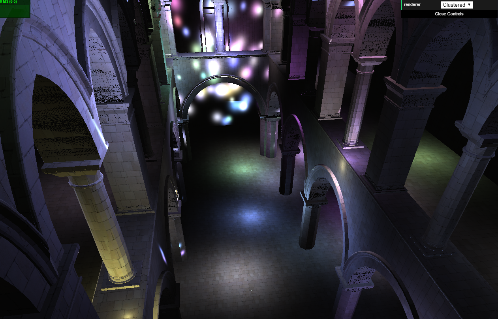
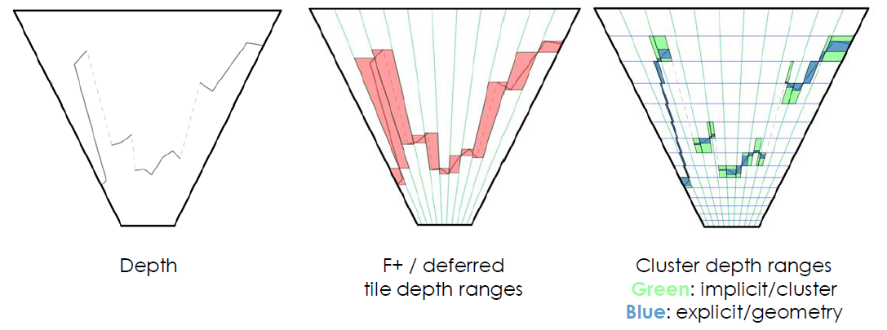
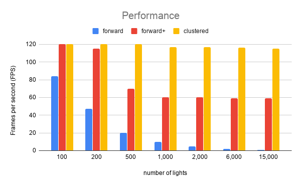

WebGL Clustered and Forward+ Shading
======================

**University of Pennsylvania, CIS 565: GPU Programming and Architecture, Project 5**

* Klayton Wittler
    * [LinkedIn](https://www.linkedin.com/in/klayton-wittler/)
* Tested on: **Google Chrome 78.0.3904.97** on
  Windows 10 Pro, i7-7700K @ 4.20GHz 16.0GB, GTX 1070 8.192GB (my PC)

## Sections

* [Introduction](#introduction)
* [Live Online](#live-online)
* [Implementation](#implemenatation)
    * [Forward plus](#forward-plus)
    * [Clustered](#clustered)
    * [Blinn-Phong](#blinn-phong)
* [Performance Analaysis](#performance-analysis)
* [Credits](#credits)

## Live Online

*Note: click the image to go to online demo.*

## Implementation

This project shows how to efficiently implement a virtual disco party scene. Check out the live demo above.

### Forward Plus

Foward plus divides the environment into tiles in screen space where the minimum and maximum depth within each tile is determined. Lights are culled by determining if they have any effect on a given tile. After this process, rendering is similar to regular forward rendering. 

### Clustered

Deferred clusting works by splitting the process into buffers. Visibility and material is given its own shader and stores its results in a buffer and light and shading is given another shader which subsequently stores its results in another buffer. These buffers can be combined at the end to give the final image. This method is the most computationally efficient in scenes with enormous amounts of lights.

### Blinn-Phong

Inorder to capture specular lighting, the [Blinn-Phong](https://en.wikipedia.org/wiki/Blinn%E2%80%93Phong_reflection_model) shading can be used. This requires the calculation of the half vector, H, and view vector, V, to do a dot product with the surface normal in order to figure out how to add on specular components of lighting. 

There seems to be some bug in the implementation of forward plus as the specular component creates a weird artifact.

However the implemenation in clustered gives a nice disco feeling

## Performance Analysis

Clustered is able to best handle increases in number of lights with hardly and performance decrease as the lights increase. Forward+ sees some performance hits as the number of lights increase but seems to have platued at around 60 FPS. Foward rendering sees an exponential performance decrease as the number of lights increase. At lower numbers the results are inconclusive since the frame rate is capped at 120 FPS.

## Credits

* [Three.js](https://github.com/mrdoob/three.js) by [@mrdoob](https://github.com/mrdoob) and contributors
* [stats.js](https://github.com/mrdoob/stats.js) by [@mrdoob](https://github.com/mrdoob) and contributors
* [webgl-debug](https://github.com/KhronosGroup/WebGLDeveloperTools) by Khronos Group Inc.
* [glMatrix](https://github.com/toji/gl-matrix) by [@toji](https://github.com/toji) and contributors
* [minimal-gltf-loader](https://github.com/shrekshao/minimal-gltf-loader) by [@shrekshao](https://github.com/shrekshao)
